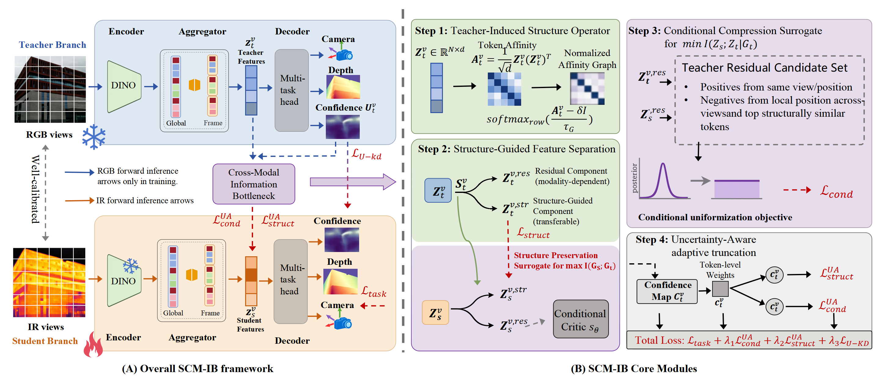

<!--
**SCM-IB/SCM-IB** is a ✨ _special_ ✨ repository because its `README.md` (this file) appears on your GitHub profile.

Here are some ideas to get you started:

- 🔭 I’m currently working on ...
- 🌱 I’m currently learning ...
- 👯 I’m looking to collaborate on ...
- 🤔 I’m looking for help with ...
- 💬 Ask me about ...
- 📫 How to reach me: ...
- 😄 Pronouns: ...
- ⚡ Fun fact: ...
-->

# SCM-SD: Structure-conditioned Cross-modal Selective Distillation for Feed-Forward Infrared 3D Reconstruction 👋


> This repository contains the SCM-SD codebase (extended from the VGGT/pi3 framework) for RGB-to-IR cross-modal distillation in feed-forward 3D reconstruction.

---

## 1. Overview 🚀

In low-light, nighttime, and smoke-occluded environments, infrared (IR) sensing is often more reliable than visible-light sensing. However, directly transferring RGB-pretrained 3D models to the IR domain usually leads to clear performance drops.  
SCM-SD revisits this problem from an information bottleneck perspective and proposes a selective distillation paradigm with **structure preservation + conditional compression + task supervision**. The goal is to preserve geometry-relevant transferable information while suppressing modality-specific redundant information during cross-modal transfer.

The manuscript reports consistent gains on two RGB-IR multi-view datasets across camera pose estimation, depth prediction, and point cloud reconstruction.
<p align="center">
  
</p>
<p align="center">
  <em>Figure 1. Overview of SCM-IB. The method performs structure-conditioned cross-modal distillation from RGB teacher features to infrared student features for feed-forward 3D reconstruction.</em>
</p>

## 2. Core Method 🧠

SCM-SD objective consists of four key components:

1. **Teacher-induced Structural Operator**  
   Builds a structural condition from teacher self-affinity and decomposes features into structure-guided and residual parts.

2. **Structure Preservation**  
   Aligns teacher/student structure-guided features to preserve transferable geometric structure.

3. **Conditional Compression**  
   Compresses teacher-student residual dependence under the structural condition to suppress non-transferable factors.

4. **Uncertainty-aware Adaptive Truncation**  
   Uses teacher confidence to modulate distillation strength and down-weight unreliable supervision regions.

Main implementation entry points:
- `training/structural_distillation_loss.py`
- `vggt/models/vggt.py` (`VGGTDualBranch`)

## 3. Repository Structure 🗂️
 
```text
scm-sd/
├─ training/
│  ├─ launch.py                          # Training entry (Hydra)
│  ├─ trainer.py                         # Main training loop / DDP
│  ├─ structural_distillation_loss.py    # SCM-IB loss
│  └─ config/colmap_dataset_scmib.yaml   # SCM-IB training config
├─ eval/
│  ├─ eval_script.py                     # Evaluation entry (pose/depth/point cloud)
│  ├─ depth_process0.py                  # Depth alignment and back-projection preprocessing
│  ├─ eval_config.yaml                   # Evaluation config example
│  └─ FINAL_METRICS_TASKS.md             # Metrics definitions
├─ vggt/                                 # Model code (including dual-branch implementation)
└─ ckpt/                                 # Checkpoint directory (example)
```
 
## 4. Environment Setup ⚙️

`requirements.txt` in this repository is in Conda-style package list format. Recommended setup:

```bash
conda create -n scmsd --file requirements.txt
conda activate scmsd
```

## 5. Data Organization 📝

The default training config expects each scene directory to follow:

```text
<scene_name>/
├─ rgb/                        # Visible images (teacher input)
├─ thermal/                    # Infrared images (student input)
├─ depth_aligned/              # Aligned depth GT (PNG or NPY)
├─ depth_params.json           # Depth alignment parameters (optional)
└─ colmap/
   └─ sparse/0/
      ├─ cameras.bin
      ├─ images.bin
      └─ points3D.bin
```

If your raw depth is not aligned, run:

```bash
python eval/depth_process0.py --dataset_root <YOUR_DATASET_ROOT>
```

This script generates, per scene:
- `depth_aligned/`
- `depth_params.json`

## 6. Training ⏳

### 6.1 Update Configuration

Edit the following fields in `training/config/colmap_dataset_scmsd.yaml`:

- `data.train.dataset.dataset_configs[0].COLMAP_DIR`
- `data.val.dataset.dataset_configs[0].COLMAP_DIR`
- `model.visible_model_path` (teacher checkpoint)
- `model.infrared_model_path` (optional student initialization checkpoint)

### 6.2 Single-GPU Training

```bash
python training/launch.py --config colmap_dataset_scmsd
```

### 6.3 Multi-GPU Training

```bash
torchrun --nproc_per_node=4 training/launch.py --config colmap_dataset_scmsd
```

Default outputs:
- `logs/colmap_dataset_structural_distillation/tensorboard`
- `logs/colmap_dataset_structural_distillation/ckpts`

## 7. Evaluation 🖼️

### 7.1 Config-based Evaluation (Recommended)

Edit `eval/eval_config.yaml`:
- `data_dir`: dataset root
- `ckpt_dirs`: list of checkpoint directories to evaluate
- `input_frames`: e.g. `[3, 4, 6, 8, 10, 12]`

Run:

```bash
python eval/eval_script.py --config eval/eval_config.yaml
```

> Note: `eval/eval_script.py` uses a default `--config` path that does not match this repository layout. It is recommended to always pass `--config eval/eval_config.yaml` explicitly.

### 7.2 Supported Metrics

1. **Camera Pose**: `ate`, `rpe_rot`, `rpe_trans`, `rra_*`, `rta_*`, `auc_*`
2. **Multi-view Depth**: `abs_rel_scale`, `delta_1.25_scale`, `abs_rel_scale_shift`, `delta_1.25_scale_shift`
3. **Monocular Depth**: `abs_rel_mono`, `delta_1.25_mono`
4. **Point Cloud Reconstruction**: `acc`, `comp`, `nc`, `fscore_da`, etc.

See `eval/FINAL_METRICS_TASKS.md` for metric definitions.

## 8. Key Hyperparameters (SCM-SD) 🧪

Location: `training/config/colmap_dataset_scmib.yaml`

- `loss.structural_distillation.delta`
- `loss.structural_distillation.tau_g`
- `loss.structural_distillation.tau`
- `loss.structural_distillation.topk`
- `loss.structural_distillation.candidate_strategy` (`A` / `B` / `A+B`)
- `loss.structural_distillation.max_candidates`
- `loss.structural_distillation.structure_preservation_weight`
- `loss.structural_distillation.conditional_compression_weight`
- `loss.structural_distillation.uncertainty_distillation_weight`
- `loss.structural_distillation.use_uncertainty`

## 9. Paper-to-Code Mapping  🧭

- Main method implementation: `training/structural_distillation_loss.py`
- Dual-branch teacher/student network: `vggt/models/vggt.py` (`VGGTDualBranch`)
- Training pipeline: `training/trainer.py`
- Evaluation pipeline: `eval/eval_script.py`
- Depth alignment preprocessing: `eval/depth_process0.py`
- 
## 10. ✅ To Do List

- [x] 🚀 Initial code release
- [x] 🧠 Dual-branch teacher-student framework
- [x] 🧩 Structural distillation loss implementation
- [x] 📊 Evaluation pipeline for pose / depth / point cloud
- [x] 🗂️ Example training and evaluation configs
- [x] 📝 Detailed training tutorial
- [x] 🗃️ Custom dataset preparation guide
- [ ] 🖼️ More qualitative visualization results
- [ ] 🧪 Additional ablation-study scripts
- [ ] 📚 Final BibTeX citation after publication
- [ ] 🔥 Inference/demo scripts
- [ ] 🧹 Code cleanup and refactoring

## 10. Citation 📚

If this work helps your research, please cite this paper  
After official release (e.g., Journal version), replace with the final BibTeX.


## 11. Acknowledgement 🙏

This project is implemented by extending the VGGT & pi3 codebase and introducing SCM-IB for RGB-IR cross-modal distillation.

